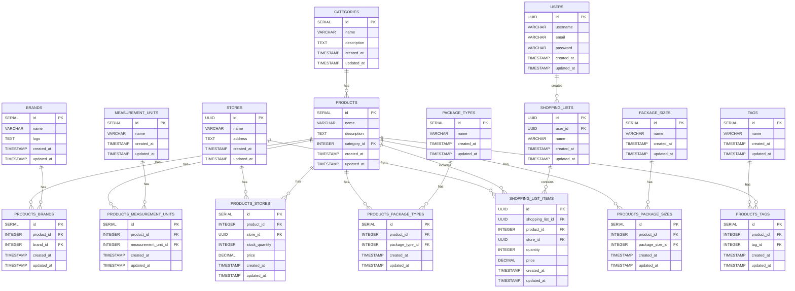

```mermaid
erDiagram
USERS {
UUID id PK
VARCHAR username
VARCHAR email
VARCHAR password
TIMESTAMP created_at
TIMESTAMP updated_at
}
CATEGORIES {
SERIAL id PK
VARCHAR name
TEXT description
TIMESTAMP created_at
TIMESTAMP updated_at
}
STORES {
UUID id PK
VARCHAR name
TEXT address
TIMESTAMP created_at
TIMESTAMP updated_at
}
BRANDS {
SERIAL id PK
VARCHAR name
TEXT logo
TIMESTAMP created_at
TIMESTAMP updated_at
}
MEASUREMENT_UNITS {
SERIAL id PK
VARCHAR name
TIMESTAMP created_at
TIMESTAMP updated_at
}
PACKAGE_TYPES {
SERIAL id PK
VARCHAR name
TIMESTAMP created_at
TIMESTAMP updated_at
}
PACKAGE_SIZES {
SERIAL id PK
VARCHAR name
TIMESTAMP created_at
TIMESTAMP updated_at
}
TAGS {
SERIAL id PK
VARCHAR name
TIMESTAMP created_at
TIMESTAMP updated_at
}
PRODUCTS {
SERIAL id PK
VARCHAR name
TEXT description
INTEGER category_id FK
TIMESTAMP created_at
TIMESTAMP updated_at
}
PRODUCTS_BRANDS {
SERIAL id PK
INTEGER product_id FK
INTEGER brand_id FK
TIMESTAMP created_at
TIMESTAMP updated_at
}
PRODUCTS_MEASUREMENT_UNITS {
SERIAL id PK
INTEGER product_id FK
INTEGER measurement_unit_id FK
TIMESTAMP created_at
TIMESTAMP updated_at
}
PRODUCTS_PACKAGE_TYPES {
SERIAL id PK
INTEGER product_id FK
INTEGER package_type_id FK
TIMESTAMP created_at
TIMESTAMP updated_at
}
PRODUCTS_PACKAGE_SIZES {
SERIAL id PK
INTEGER product_id FK
INTEGER package_size_id FK
TIMESTAMP created_at
TIMESTAMP updated_at
}
PRODUCTS_STORES {
SERIAL id PK
INTEGER product_id FK
UUID store_id FK
INTEGER stock_quantity
DECIMAL price
TIMESTAMP created_at
TIMESTAMP updated_at
}
PRODUCTS_TAGS {
SERIAL id PK
INTEGER product_id FK
INTEGER tag_id FK
TIMESTAMP created_at
TIMESTAMP updated_at
}
SHOPPING_LISTS {
UUID id PK
UUID user_id FK
VARCHAR name
TIMESTAMP created_at
TIMESTAMP updated_at
}
SHOPPING_LIST_ITEMS {
UUID id PK
UUID shopping_list_id FK
INTEGER product_id FK
UUID store_id FK
INTEGER quantity
DECIMAL price
TIMESTAMP created_at
TIMESTAMP updated_at
}

    CATEGORIES ||--o{ PRODUCTS : has
    BRANDS ||--o{ PRODUCTS_BRANDS : has
    PRODUCTS ||--o{ PRODUCTS_BRANDS : has
    MEASUREMENT_UNITS ||--o{ PRODUCTS_MEASUREMENT_UNITS : has
    PRODUCTS ||--o{ PRODUCTS_MEASUREMENT_UNITS : has
    PACKAGE_TYPES ||--o{ PRODUCTS_PACKAGE_TYPES : has
    PRODUCTS ||--o{ PRODUCTS_PACKAGE_TYPES : has
    PACKAGE_SIZES ||--o{ PRODUCTS_PACKAGE_SIZES : has
    PRODUCTS ||--o{ PRODUCTS_PACKAGE_SIZES : has
    PRODUCTS ||--o{ PRODUCTS_STORES : has
    STORES ||--o{ PRODUCTS_STORES : has
    PRODUCTS ||--o{ PRODUCTS_TAGS : has
    TAGS ||--o{ PRODUCTS_TAGS : has
    USERS ||--o{ SHOPPING_LISTS : creates
    SHOPPING_LISTS ||--o{ SHOPPING_LIST_ITEMS : contains
    PRODUCTS ||--o{ SHOPPING_LIST_ITEMS : includes
    STORES ||--o{ SHOPPING_LIST_ITEMS : from
```
